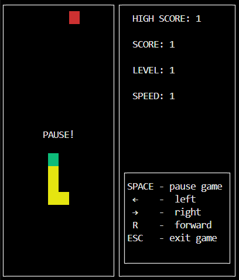
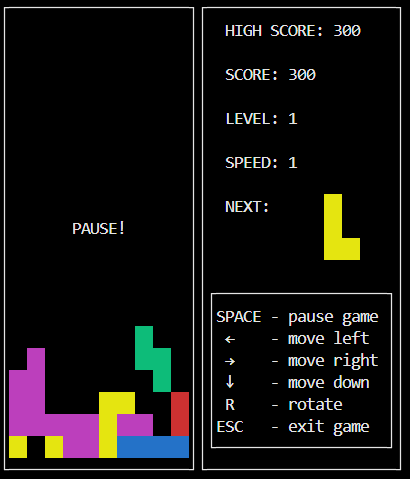
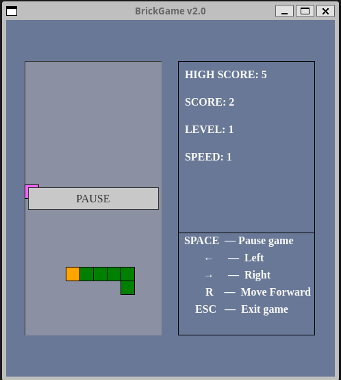
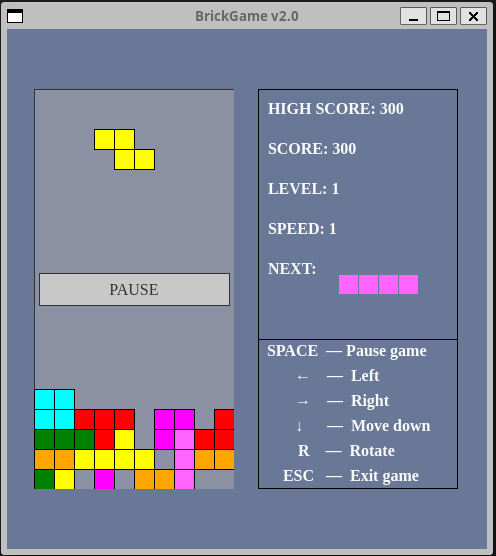

# BrickGame_V2.0 Snake

This project presents the implementation of the Snake game in the C++ programming language in the object-oriented programming paradigm.

The project consists of two separate components: a library responsible for implementing the logic of the game, and a desktop graphical interface.

The developed library is connected to the console interface from BrickGame v1.0. 

The Tetris game developed in BrickGame v1.0 is connected to the desktop interface developed in this project.

The logic of the game is placed in a separate library. The MVC pattern is used. The library is connected to the GUI via a controller.

The GUI is represented by two variants of the CLI (ncurses library) and Desktop (Qt library). The libraries of both games are covered with unit tests.

   Executable files in the 'src/build` folder:
        - snake_cli
        - snake_desktop
        - tetris_cli
        - tetris_desktop

## Requirements

    - pkg-config
    - cmake
    - ncurses
    - Qt5+
    - gtest
    - gcovr
    - doxygen

## Installation

    From the `src` folder, execute: `make

## Screenshots
Snake with a console game interface
 

Tetris with a console game interface
 

Snake with a desktop interface
 

Tetris with a desktop interface
 

