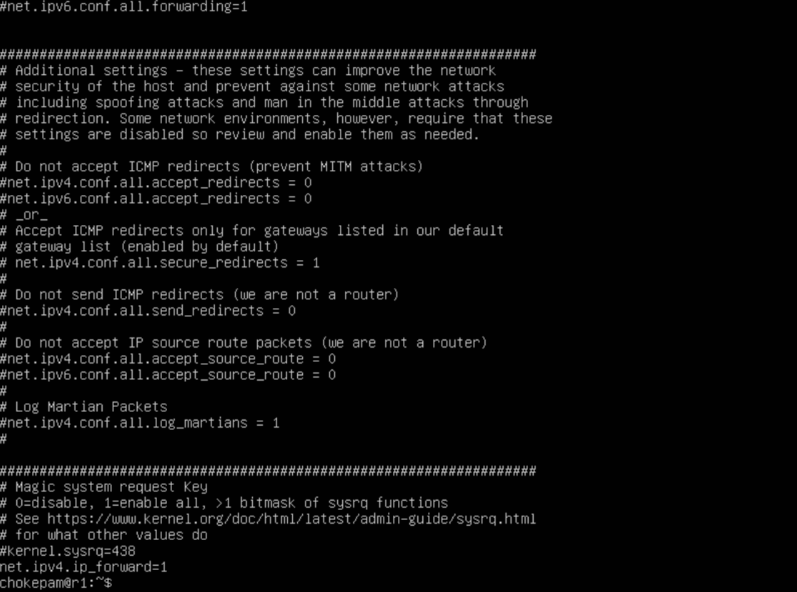

# Сети в Linux.  (chokepam).

Настройка сетей в Linux на виртуальных машинах.


## Contents

   1. [Инструмент ipcalc](#part-1-инструмент-ipcalc) \
   2. [Статическая маршрутизация между двумя машинами](#part-2-статическая-маршрутизация-между-двумя-машинами) \
   3. [Утилита iperf3](#part-3-утилита-iperf3) \
   4. [Сетевой экран](#part-4-сетевой-экран) \
   5. [Статическая маршрутизация сети](#part-5-статическая-маршрутизация-сети) \
   6. [Динамическая настройка IP с помощью DHCP](#part-6-динамическая-настройка-ip-с-помощью-dhcp) \
   7. [NAT](#part-7-nat) \
   8. [Допополнительно. Знакомство с SSH Tunnels](#part-8-дополнительно-знакомство-с-ssh-tunnels)

## Part 1. Инструмент **ipcalc**

##### Подними виртуальную машину (далее -- ws1)

#### 1.1. Сети и маски
**== Задание 1.1 ==**
##### Определи и запиши в отчёт:
##### 1.1.1) Адрес сети *192.167.38.54/13*
##### 1.1.2) Перевод маски *255.255.255.0* в префиксную и двоичную запись, */15* в обычную и двоичную, *11111111.11111111.11111111.11110000* в обычную и префиксную
##### 1.1.3) Минимальный и максимальный хост в сети *12.167.38.4* при масках: */8*, *11111111.11111111.00000000.00000000*, *255.255.254.0* и */4*

**== Выполнение 1.1==**

1.1.1) Адрес сети ip *192.167.38.54/13*:

<br>*Адрес сети ip *192.167.38.54/13*: -  192.160.0.0/13*<br>

1.1.2) Перевод маски *255.255.255.0* в префиксную и двоичную запись, */15* в обычную и двоичную, *11111111.11111111.11111111.11110000* в обычную и префиксную.

    - Перевод маски *255.255.255.0* в префиксную и двоичную запись:

<br>*Префиксная и двоичная запись маски *255.255.255.0**<br>
        - *Префиксная запись* - 24
        - *Двоичная запись* - 11111111.11111111.11111111.00000000

    *  Перевод маски */15* в обычную и двоичную:

<br>*Обычная и двоичная запись маски */15**<br>
        - *Обычная запись* - 255.254.0.0
        - *Двоичная запись* - 11111111.1111111 0.00000000.00000000

    *  Перевод маски *11111111.11111111.11111111.11110000* в обычную и префиксную:

<br>*Обычная и префиксная запись маски *11111111.11111111.11111111.11110000**<br>
        - *Префиксная запись* - 28
        - *Обычная запись* - 255.255.255.240

1.1.3) Минимальный и максимальный хост в сети *12.167.38.4* при масках: */8*, *11111111.11111111.00000000.00000000*, *255.255.254.0* и */4*

    * При маске */8*:

<br>*Минимальный и максимальный хост в сети *12.167.38.4* при маске: */8**<br>
        - *HostMin: 12.0.0.1*
        - *HostMax: 12.255.255.254*

    * При маске *11111111.11111111.00000000.00000000*:

<br>*Минимальный и максимальный хост в сети *12.167.38.4* при маске: *11111111.11111111.00000000.00000000**<br>
        - *HostMin: 12.167.0.1*
        - *HostMax: 12.167.255.254*

    * При маске *255.255.254.0*:

<br>*Минимальный и максимальный хост в сети *12.167.38.4* при маске: *255.255.254.0**<br>
        - *HostMin: 12.167.38.1*
        - *HostMax: 12.167.39.254*

    * При маске */4*:

<br>*Минимальный и максимальный хост в сети *12.167.38.4* при маске: */4**<br>
        - *HostMin: 0.0.0.1*
        - *HostMax: 15.255.255.254*


#### 1.2. localhost
**== Задание 1.2 ==**
##### Определи и запиши в отчёт, можно ли обратиться к приложению, работающему на localhost, со следующими IP: *194.34.23.100*, *127.0.0.2*, *127.1.0.1*, *128.0.0.1*

**== Выполнение 1.2 ==**

* Для доступа к приложению, работающему на localhost адрес устройства должен входить в диапазон 127.0.0.0 - 127.255.255.255.
    - с адресов: *127.0.0.2*, *127.1.0.1* - можно обратиться к приложению на localhost
    - с адресов: *194.34.23.100*, *128.0.0.1*- нельзя обратиться к приложению на localhost


#### 1.3. Диапазоны и сегменты сетей
**== Задание 1.3 ==**
##### Определи и запиши в отчёт:
##### 1.3.1) Какие из перечисленных IP можно использовать в качестве публичного, а какие только в качестве частных: *10.0.0.45*, *134.43.0.2*, *192.168.4.2*, *172.20.250.4*, *172.0.2.1*, *192.172.0.1*, *172.68.0.2*, *172.16.255.255*, *10.10.10.10*, *192.169.168.1*
##### 1.3.2) Какие из перечисленных IP адресов шлюза возможны у сети *10.10.0.0/18*: *10.0.0.1*, *10.10.0.2*, *10.10.10.10*, *10.10.100.1*, *10.10.1.255*

**== Выполнение 1.3 ==**

1.3.1) Из перечисленных IP можно использовать в качестве: 

        публичных:
            134.43.0.2/16
            172.0.2.1/12
            192.172.0.1/12 
            172.68.0.2/12
            192.169.168.1/16

        частных:
            10.0.0.45/8
            192.168.4.2/16
            172.20.250.4/12
            172.16.255.255/12
            10.10.10.10/8

* Публичные (public) IP-адреса - уникальные адреса, которые не должны повторяться в глобальной сети. 
    - находятся в диапазоне от 1.0.0.1 - 223.255.255.254 за исключением частных IP-адресов.
* Частные (private) IP-адреса - используются в локальных сетях. 
    - Адресное пространство частных IPv4-адресов состоит из 3-х блоков: 
        - 10.0.0.0 - 10.255.255.255 (класс А);
        - 172.16.0.0.-172.31.255.255 (класс В);
        - 192.168.0.0-192.168.255.255 (класс С).

1.3.2) Из перечисленных IP адресов шлюза у сети *10.10.0.0/18* возможны адреса: 

        10.10.0.2
        10.10.10.10
        10.10.1.255

<br>*Диапазон IP-адресов в сети *10.10.0.0* при маске: */18**<br>


## Part 2. Статическая маршрутизация между двумя машинами

**== Задание 2 ==**
##### Подними две виртуальные машины (далее -- ws1 и ws2).

##### С помощью команды `ip a` посмотри существующие сетевые интерфейсы.
- В отчёт помести скрин с вызовом и выводом использованной команды.
##### Опиши сетевой интерфейс, соответствующий внутренней сети, на обеих машинах и задать следующие адреса и маски: ws1 - *192.168.100.10*, маска */16*, ws2 - *172.24.116.8*, маска */12*.
- В отчёт помести скрины с содержанием изменённого файла *etc/netplan/00-installer-config.yaml* для каждой машины.
##### Выполни команду `netplan apply` для перезапуска сервиса сети.
- В отчёт помести скрин с вызовом и выводом использованной команды.


**== Выполнение 2 ==**
* Создаем две виртуальные машины ws1 и ws2.
* С помощью команды: `ip a` смотрим существующие сетевые интерфейсы этих машин.

<br>*Сетевые интерфейсы ws1*<br>

<br>*Сетевые интерфейсы ws2*<br>

* Описание сетевого интерфейса, соответствующего внутренней сети под номером 1: `lo` - это (внутренний) петлевой адрес, используемый для связи внутри компьютера.
* На обеих машинах прописываем в `sudo vim /etc/netplan/00-installer-config.yaml` необходимые адреса и маски, отключаем DHCP :
    - ws1 - *192.168.100.10*, маска */16* 
    
<br>*Настройки адаптера `enp0s3` на ws1*<br>

    - ws2 - *172.24.116.8*, маска */12*
    
<br>*Настройки адаптера `enp0s3` на ws2*<br>

* Командой `sudo netplan apply` перезапускаем сервис сети, для каждой машины:

<br>*Вызов команды:`sudo netplan apply` на ws1(слева) и ws2(справа)*<br>


#### 2.1. Добавление статического маршрута вручную

**== Задание 2.1 ==**
##### Добавь статический маршрут от одной машины до другой и обратно при помощи команды вида `ip r add`.
##### Пропингуй соединение между машинами.
- В отчёт помести скрин с вызовом и выводом использованных команд.

**== Выполнение 2.1 ==**
* В VirtualBox в настройках сети виртуальных машин выбираем тип подключения: "внутренняя сеть"  
* Добавление статического маршрута на ws1 (*192.168.100.10*) командой: `sudo ip r add 172.24.116.8 dev enp0s3`:

<br>*Вызов команд:`sudo ip r add 172.24.116.8 dev enp0s3`, `ip a` и `ip r` на ws1*<br>

* Добавление статического маршрута на ws2 (*172.24.116.8*) командой: `sudo ip r add 192.168.100.10 dev enp0s3`:

<br>*Вызов команд:`sudo ip r add 172.24.116.8 dev enp0s3`, `ip a` и `ip r` на ws2*<br>

* Проверка соединения между машинами
    - пинг с машины ws1 (*192.168.100.10*) - успешно:
    
<br>*Вызов команды:`ping -c 4 172.24.116.8` с ws1 на ws2*<br>
    - пинг с машины ws2 (*172.24.116.8*) - успешно:
    
<br>*Вызов команды:`ping -c 4 192.168.100.10` с ws2 на ws1*<br>


#### 2.2. Добавление статического маршрута с сохранением

**== Задание 2.2 ==**
##### Перезапусти машины.
##### Добавь статический маршрут от одной машины до другой с помощью файла *etc/netplan/00-installer-config.yaml*.
- В отчёт помести скрин с содержанием изменённого файла *etc/netplan/00-installer-config.yaml*.
##### Пропингуй соединение между машинами.
- В отчёт помести скрин с вызовом и выводом использованной команды.

**== Выполнение 2.2 ==**
* Перезагружаем обе машины: `reboot`
* Открываем и прописываем в: `sudo vim /etc/netplan/00-installer-config.yaml` статический маршрут для каждой машины
    - Для  ws1:
        
<br>*Вызов команды: `sudo vim /etc/netplan/00-installer-config.yaml`, добавлен статический маршрут от ws1 до ws2*<br>

    - Для  ws2:
        
<br>*Вызов команды: `sudo vim /etc/netplan/00-installer-config.yaml`, добавлен статический маршрут от ws2 до ws1*<br>

* Проверка соединения между машинами
    - пинг с машины ws1 (*192.168.100.10*) - успешно:
    
<br>*Вызов команды:`ping -c 4 172.24.116.8` с ws1 на ws2*<br>
    - пинг с машины ws2 (*172.24.116.8*) - успешно:
    
<br>*Вызов команды:`ping -c 4 192.168.100.10` с ws2 на ws1*<br>


## Part 3. Утилита **iperf3**

#### 3.1. Скорость соединения

**== Задание 3.1 ==**
##### Переведи и запиши в отчёт: 8 Mbps в MB/s, 100 MB/s в Kbps, 1 Gbps в Mbps.
**== Выполнение 3.1 ==**

* Скорость соединения:
    * 8 Mbps = 1 MB/s  (Мегабит/сек в Мегабайт/сек)
    * 100 MB/s = 800000 Kbps  (Мегабайт/сек в Килобит/сек)
    * 1 Gbps = 1000 Mbps (Гигабит/сек в Мегабит/сек)

#### 3.2. Утилита **iperf3**

**== Задание 3.2 ==**
##### Измерь скорость соединения между ws1 и ws2.
- В отчёт помести скрины с вызовом и выводом использованных команд.

**== Выполнение 3.2 ==**
* Для установки **iperf3** с репозиториев ubuntu (для доступа в сеть интернет) для каждой машины: 
    - в VirtualBox добавляем сетевой адаптер, выбираем тип подключения NAT
    - командой: `ip a` определяем имя нового интерфейса (здесь - enp0s8)
    - добавляем его в `sudo vim /etc/netplan/00-installer-config.yaml`, DHCP - true
        
<br>*Вызов команды: `sudo vim /etc/netplan/00-installer-config.yaml` - добавлено `enp0s8: dhcp4: true` на ws1(слева) и ws2(справа)*<br>
    - применяем командой: `sudo netplan apply`
    - теперь можно установить **iperf3** командой: `sudo apt install iperf3`. 
* Командой: `sudo iperf3 -s` запускаем серверную часть на ws1. 
<br>Командой: `sudo iperf3 -с 192.168.100.10` запускаем клиентскую часть на ws2.

    - Результат работы `perf3` на ws1:
    
<br>*Вызов и результат команды:`sudo iperf3 -s` на ws1*<br>

    - Результат работы `perf3` на ws2:
    
<br>*Вызов и результат команды:`sudo iperf3 -с 192.168.100.10` на ws2*<br>


## Part 4. Сетевой экран

#### 4.1. Утилита **iptables**
**== Задание 4.1 ==**
##### Создай файл */etc/firewall.sh*, имитирующий фаерволл, на ws1 и ws2:
```shell
#!/bin/sh

# Удаление всех правил в таблице «filter» (по-умолчанию).
iptables -F
iptables -X
```
##### Нужно добавить в файл подряд следующие правила:
##### 1) На ws1 примени стратегию, когда в начале пишется запрещающее правило, а в конце пишется разрешающее правило (это касается пунктов 4 и 5).
##### 2) На ws2 примени стратегию, когда в начале пишется разрешающее правило, а в конце пишется запрещающее правило (это касается пунктов 4 и 5).
##### 3) Открой на машинах доступ для порта 22 (ssh) и порта 80 (http).
##### 4) Запрети *echo reply* (машина не должна «пинговаться», т.е. должна быть блокировка на OUTPUT).
##### 5) Разреши *echo reply* (машина должна «пинговаться»).
- В отчёт помести скрины с содержанием файла */etc/firewall* для каждой машины.
##### Запусти файлы на обеих машинах командами `chmod +x /etc/firewall.sh` и `/etc/firewall.sh`.
- В отчёт помести скрины с запуском обоих файлов;
- В отчёте опиши разницу между стратегиями, применёнными в первом и втором файлах.

**== Выполнение 4.1 ==**

* Создаем файл командой: `sudo vim /etc/firewall.sh` имитирующий фаерволл для каждой из машин, в котором:    
    - открываем доступ для порта 22 (ssh) и порта 80 (http), 
    - для ws1 сначала запрещаем *echo reply*, потом разрешаем, 
   
        
<br>*Содержание файла */etc/firewall* для машины ws1*<br>
    - для ws2 наоборот сначала разрешаем *echo reply*, потом запрещаем

        
<br>*Содержание файла */etc/firewall* для машины ws2*<br> 

* Запуcк файлов на обеих машинах командами: `sudo chmod +x /etc/firewall.sh` - выдаем права на запуск и `sudo sh /etc/firewall.sh` - запускаем файлы.
    - Запуск на ws1:
      
<br>*Запуск и выполнение команд: `sudo chmod +x /etc/firewall.sh` и `sudo sh /etc/firewall.sh` на ws1*<br> 

    - Запуск на ws2:
      
<br>*Запуск и выполнение команд: `sudo chmod +x /etc/firewall.sh` и `sudo sh /etc/firewall.sh` на ws2*<br> 

    - В обоих случаях командой: `sudo iptables -L` выводим все правила в текущей цепочке, видим, что правила из `/etc/firewall.sh` были добавлены.

 * Разница между стратегиями, применёнными в первом и втором файлах заключается в том что **iptables** выполняет правила по очереди, таким образом:

        - так как на ws1 первым прописано запрещающее правило - REJECT, то ws1 не будет «пинговаться» (ответ от нее не будет получен)
        - так как на ws2 первым прописано разрешающее правило - ACCEPT, то ws2 будет «пинговаться» 


#### 4.2. Утилита **nmap**

**== Задание 4.2 ==**
##### Командой **ping** найди машину, которая не «пингуется», после чего утилитой **nmap** покажи, что хост машины запущен.
*Проверка: в выводе nmap должно быть сказано: `Host is up`*.
- В отчёт помести скрины с вызовом и выводом использованных команд **ping** и **nmap**.

##### Сохрани дампы образов виртуальных машин

**== Выполнение 4.2 ==**

* **Ping** с ws1 на ws2 - «пингуется»:
      
<br>*Команда: `ping -c 4 172.24.116.8` c ws1 на ws2 - «пингуется»*<br> 

* **Ping** с ws2 на ws1 - не «пингуется», запускаем: `sudo nmap 192.168.100.10`:
      
<br>*Команда: `ping -c 4 192.168.100.10` и `sudo nmap 192.168.100.10` c ws1 на ws2 - нет пинга, `Host is up`*<br> 


* ##### Сохраняем дампы образов виртуальных машин ws1 и ws2 в VirtualBox. 


## Part 5. Статическая маршрутизация сети
**== Задание ==**

Сеть: \


##### Подними пять виртуальных машин (3 рабочие станции (ws11, ws21, ws22) и 2 роутера (r1, r2)).

#### 5.1. Настройка адресов машин

**== Задание 5.1 ==**

##### Настрой конфигурации машин в *etc/netplan/00-installer-config.yaml* согласно сети на рисунке.
- В отчёт помести скрины с содержанием файла *etc/netplan/00-installer-config.yaml* для каждой машины.
##### Перезапусти сервис сети. Если ошибок нет, то командой `ip -4 a` проверь, что адрес машины задан верно. Также пропингуй ws22 с ws21. Аналогично пропингуй r1 с ws11.
- В отчёт помести скрины с вызовом и выводом использованных команд.

**== Выполнение 5.1 ==**

* Создаем виртуальные машины согласно сети на рисунке и настраиваем конфигурации сети для каждой машины

    - Для ws11 прописываем в:`sudo vim etc/netplan/00-installer-config.yaml`:
      
<br>*Содержание файла *etc/netplan/00-installer-config.yaml* для ws11*<br> 

    - Для r1 прописываем в:`sudo vim etc/netplan/00-installer-config.yaml`:
      
<br>*Содержание файла *etc/netplan/00-installer-config.yaml* для r1*<br> 

    - Для r2 прописываем в:`sudo vim etc/netplan/00-installer-config.yaml`:
      
<br>*Содержание файла *etc/netplan/00-installer-config.yaml* для r2*<br> 

    - Для ws22 прописываем в:`sudo vim etc/netplan/00-installer-config.yaml`:
      
<br>*Содержание файла *etc/netplan/00-installer-config.yaml* для ws22*<br> 

    - Для ws21 прописываем в:`sudo vim etc/netplan/00-installer-config.yaml`:
      
<br>*Содержание файла *etc/netplan/00-installer-config.yaml* для ws21*<br> 


* Перезапуск сервиса сети  командой: `sudo netplan apply` и выполнение команды: `ip -4 a` для каждой машины:
    - ws11:
          
<br>*Выполнение команд: `sudo netplan apply`и `ip -4 a` для ws11*<br> 
    - r1:
          
<br>*Выполнение команд: `sudo netplan apply`и `ip -4 a` для r1*<br> 
    - r2:
          
<br>*Выполнение команд: `sudo netplan apply`и `ip -4 a` для r2*<br> 
    - ws22:
          
<br>*Выполнение команд: `sudo netplan apply`и `ip -4 a` для ws22*<br> 
    - ws21:
          
<br>*Выполнение команд: `sudo netplan apply`и `ip -4 a` для ws21*<br> 


#### 5.2. Включение переадресации IP-адресов

**== Задание 5.2 ==**

##### Для включения переадресации IP, выполни команду на роутерах:
`sysctl -w net.ipv4.ip_forward=1`
*При таком подходе переадресация не будет работать после перезагрузки системы.*
- В отчёт помести скрин с вызовом и выводом использованной команды.
##### Открой файл */etc/sysctl.conf* и добавь в него следующую строку:
`net.ipv4.ip_forward = 1`
*При использовании этого подхода, IP-переадресация включена на постоянной основе.*
- В отчёт помести скрин с содержанием изменённого файла */etc/sysctl.conf*.

**== Выполнение 5.2 ==**

* Для включения на роутерах временной переадресации IP (до перезагрузки) - выполняем команду: `sysctl -w net.ipv4.ip_forward=1` 
    - r1:
    
<br>*Выполнение команд: `sudo sysctl -w net.ipv4.ip_forward=1` для r1*<br> 
    - r2:
    
<br>*Выполнение команд: `sudo sysctl -w net.ipv4.ip_forward=1` для r2*<br> 

* Для включения на роутерах IP-переадресации на постоянной основе открываем файл `sudo vim /etc/sysctl.conf`и добавляем строку: `net.ipv4.ip_forward = 1`
    - r1:
    
<br>*Содержание измененного файла*/etc/sysctl.conf* для r1*<br> 
    - r2:
    
<br>*Содержание измененного файла*/etc/sysctl.conf* для r2*<br> 


#### 5.3. Установка маршрута по-умолчанию

**== Задание 5.3 ==**

##### Настрой маршрут по-умолчанию (шлюз) для рабочих станций. Для этого добавь `default` перед IP роутера в файле конфигураций.
- В отчёт помести скрин с содержанием файла *etc/netplan/00-installer-config.yaml*;
##### Вызови `ip r` и покажи, что добавился маршрут в таблицу маршрутизации.
- В отчёт помести скрин с вызовом и выводом использованной команды.
##### Пропингуй с ws11 роутер r2 и покажи на r2, что пинг доходит. Для этого используй команду:
`tcpdump -tn -i eth0`
- В отчёт помести скрин с вызовом и выводом использованных команд.

**== Выполнение 5.3 ==**

* Для настройки маршрута по-умолчанию на всех трех рабочих станциях корректируем в них файлы конфигурации: `sudo vim etc/netplan/00-installer-config.yaml`, добавляя в них *gateway4* и применяем измененную конфиггурацию командой: `sudo netplan apply`.
    - ws11:
          
<br>*Содержание измененного файла: `etc/netplan/00-installer-config.yaml` для ws11*<br> 
    - ws22:
          
<br>*Содержание измененного файла: `etc/netplan/00-installer-config.yaml` для ws22*<br> 
    - ws21:
          
<br>*Содержание измененного файла: `etc/netplan/00-installer-config.yaml` для ws21*<br> 


* Командой: `ip r` проверяем что маршруты добавлены:
    - ws11:
          
<br>*Маршрут ws11*<br> 

    - ws22:
          
<br>*Маршрут ws22*<br> 

    - ws21:
          
<br>*Маршрут ws21*<br> 

* Запускаем пинг с ws11 на роутер r2 и командой: `tcpdump -tn -i eth0` смотрим на роутере r2 , что пинг доходит:
    - ws11
         
<br>*Выпонление команды: `ping 10.100.0.12` c ws11*<br> 
    - r1
         
<br>*Выпонление команды: `sudo tcpdump -tn -i eth0` на r1*<br> 


#### 5.4. Добавление статических маршрутов

**== Задание 5.4 ==**

##### Добавь в роутеры r1 и r2 статические маршруты в файле конфигураций.
- В отчёт помести скрины с содержанием изменённого файла *etc/netplan/00-installer-config.yaml* для каждого роутера.
##### Вызови `ip r` и покажи таблицы с маршрутами на обоих роутерах. 
- В отчёт помести скрин с вызовом и выводом использованной команды.
##### Запусти команды на ws11:
`ip r list 10.10.0.0/[маска сети]` и `ip r list 0.0.0.0/0`
- В отчёт помести скрин с вызовом и выводом использованных команд;
- В отчёте объясни, почему для адреса 10.10.0.0/\[маска сети\] был выбран маршрут, отличный от 0.0.0.0/0, хотя он попадает под маршрут по-умолчанию.

**== Выполнение 5.4 ==**

* Добавляем в роутеры r1 и r2 статические маршруты в файлы конфигураций
    - Для r1 прописываем в:`sudo vim etc/netplan/00-installer-config.yaml`:
      
<br>*Содержание файла *etc/netplan/00-installer-config.yaml* для r1*<br> 

    - Для r2 прописываем в:`sudo vim etc/netplan/00-installer-config.yaml`:
      
<br>*Содержание файла *etc/netplan/00-installer-config.yaml* для r2*<br> 

* Вызываем `ip r` для просмотра таблиц с маршрутами на обоих роутерах:
    - r1:
          
<br>*Маршрут r1*<br> 

    - r2:
          
<br>*Маршрут r2*<br> 


* Запускаем на ws11 команды:`ip r list 10.10.0.0/[маска сети]` и `ip r list 0.0.0.0/0`:

    
<br>*Маршруты ws11 для 10.10.0.0/18 и 0.0.0.0/0*<br> 


* Для адреса 10.10.0.0/18 был выбран другой маршрут согласно алгоритму работы таблицы марщрутизации, поскольку ip-адрес назначения входит в адресный диапазон сетевого интерфейса роутера, трафик направляется на данный интерфейс, приоритет выбирается по маршруту с наиболее длинной маской, как более оптимальный. Маршрут по умолчанию `default`  имеет низкий приоритет, поэтому применяется при выборе маршрута в случае соответствия ip-адреса назначения нескольким сетевым интерфейсам, либо при несоответствии ни одному из правил в таблице маршрутизации.


#### 5.5. Построение списка маршрутизаторов

**== Задание 5.5 ==**

##### Запусти на r1 команду дампа:
`tcpdump -tnv -i eth0`
##### При помощи утилиты **traceroute** построй список маршрутизаторов на пути от ws11 до ws21.
- В отчёт помести скрины с вызовом и выводом использованных команд (tcpdump и traceroute);
- В отчёте, опираясь на вывод, полученный из дампа на r1, объясни принцип работы построения пути при помощи **traceroute**.

**== Выполнение 5.5 ==**

* На роутере r1 запускаем команду дампа: `sudo tcpdump -tnv -i enp0s3`, на ws11 запускаем: `traceroute 10.20.0.10`

     - ws11:
    
<br>*Выполнение `traceroute 10.20.0.10` на ws11*<br> 

     - r1:
    
<br>*Выполнение `sudo tcpdump -tnv -i enp0s3` на r1*<br> 

* Для определения промежуточных маршрутизаторов traceroute отправляет серию пакетов данных целевому узлу, при этом каждый раз увеличивая на 1 значение поля TTL («время жизни»). Это поле обычно указывает максимальное количество маршрутизаторов, которое может быть пройдено пакетом. Первый пакет отправляется с TTL, равным 1, и поэтому первый же маршрутизатор возвращает обратно сообщение ICMP, указывающее на невозможность доставки данных. Traceroute фиксирует адрес маршрутизатора, а также время между отправкой пакета и получением ответа (эти сведения выводятся на монитор компьютера). Затем traceroute повторяет отправку пакета, но уже с TTL, равным 2, что позволяет первому маршрутизатору пропустить пакет дальше.
Процесс повторяется до тех пор, пока при определённом значении TTL пакет не достигнет целевого узла. При получении ответа от этого узла процесс трассировки считается завершённым.


#### 5.6. Использование протокола **ICMP** при маршрутизации

**== Задание 5.6 ==**
##### Запусти на r1 перехват сетевого трафика, проходящего через eth0 с помощью команды:
`tcpdump -n -i eth0 icmp`
##### Пропингуй с ws11 несуществующий IP (например, *10.30.0.111*) с помощью команды:
`ping -c 1 10.30.0.111`
- В отчёт помести скрин с вызовом и выводом использованных команд.

##### Сохрани дампы образов виртуальных машин.


**== Выполнение 5.6 ==**

* Запускаем на r1 перехват сетевого трафика, с помощью команды:
`sudo tcpdump -n -i enp0s3 icmp`, на  ws11 запускаем:`ping -c 1 10.30.0.111`

     - ws11:
    
<br>*Выполнение `ping -c 1 10.30.0.111` на ws11*<br> 

     - r1:
    
<br>*Выполнение `sudo tcpdump -n -i enp0s3 icmp` на r1*<br> 


## Part 6. Динамическая настройка IP с помощью **DHCP**

**== Задание 6.1 ==**

##### Для r2 настрой в файле */etc/dhcp/dhcpd.conf* конфигурацию службы **DHCP**:
##### 1) Укажи адрес маршрутизатора по-умолчанию, DNS-сервер и адрес внутренней сети. 
Пример файла для r2:
```shell
subnet 10.100.0.0 netmask 255.255.0.0 {}

subnet 10.20.0.0 netmask 255.255.255.192
{
    range 10.20.0.2 10.20.0.50;
    option routers 10.20.0.1;
    option domain-name-servers 10.20.0.1;
}
```
##### 2) В файле *resolv.conf* пропиши `nameserver 8.8.8.8`.
- В отчёт помести скрины с содержанием изменённых файлов.

##### Перезагрузи службу **DHCP** командой `systemctl restart isc-dhcp-server`. Машину ws21 перезагрузи при помощи `reboot` и через `ip a` покажи, что она получила адрес. Также пропингуй ws22 с ws21.
- В отчёт помести скрины с вызовом и выводом использованных команд.

**== Выполнение 6.1 ==**

* После установки **DHCP** сервера на r2: `sudo apt install isc-dhcp-server` настраиваем его конфигурацию: `sudo vim /etc/dhcp/dhcpd.conf` согласнсо примеру из задания
     - r2:
    
<br>*Измененный файл `/etc/dhcp/dhcpd.conf` на r2*<br> 

*  В файле *resolv.conf* прописываем `nameserver 8.8.8.8`
    - r2:
    
<br>*Измененный файл `resolv.conf` на r2*<br> 

* Перезагружаем на r2 службу **DHCP** командой: `sudo systemctl restart isc-dhcp-server`
     - r2:
    
<br>*Перезагрузка **DHCP** на r2*<br> 

* В:`sudo vim etc/netplan/00-installer-config.yaml` ws21 включаем `dhcp4: true`, закомменичиваем статические настройки и перезагружаем  
    - ws21:
          
<br>*Содержание измененного файла: `etc/netplan/00-installer-config.yaml` для ws21*<br> 

    - ws21 получен ip-адрес из диапазона, указанного в настройках DHCP:
          
<br>*Получен ip-адрес `10.20.0.3`*<br> 

* Пингуем ws22 (10.20.0.20) с машины ws21 (10.20.0.3)
    - ws21 - ответ от ws22 получен успешно:
    
<br>*Команда: `ping -c 4 10.20.0.20` c ws21*<br> 

**== Задание 6.2 ==**

##### Укажи MAC адрес у ws11, для этого в *etc/netplan/00-installer-config.yaml* надо добавить строки: `macaddress: 10:10:10:10:10:BA`, `dhcp4: true`.
- В отчёт помести скрин с содержанием изменённого файла *etc/netplan/00-installer-config.yaml*.
##### Для r1 настрой аналогично r2, но сделай выдачу адресов с жесткой привязкой к MAC-адресу (ws11). Проведи аналогичные тесты.
- В отчёте этот пункт опиши аналогично настройке для r2.
##### Запроси с ws21 обновление ip адреса.
- В отчёте помести скрины ip до и после обновления.
- В отчёте опиши, какими опциями **DHCP** сервера пользовался в данном пункте.
##### Сохрани дампы образов виртуальных машин.

**== Выполнение 6.2 ==**

* Для машины ws11 меняем параметры в `sudo vim etc/netplan/00-installer-config.yaml`, включаем `dhcp4: true`, `macaddress: 10:10:10:10:10:BA`, закомменчиваем статические настройки. Также меняем MAC адрес у ws11 в настройках VirtualBox на этот же.
  - ws11
    
<br>*Содержание измененного файла: `etc/netplan/00-installer-config.yaml`*<br> 

* Настраиваем r1 аналогично r2, но выдачу адресов делаем с жесткой привязкой к MAC-адресу (ws11):
    - После установки **DHCP** сервера на r2: `sudo apt install isc-dhcp-server` настраиваем его конфигурацию: `sudo vim /etc/dhcp/dhcpd.conf`
     - r1:
    
<br>*Измененный файл `/etc/dhcp/dhcpd.conf` на r1*<br> 

*  В файле *resolv.conf* прописываем `nameserver 8.8.8.8`
    - r1:
    
<br>*Измененный файл `resolv.conf` на r2*<br> 

* Перезагружаем на r1 службу **DHCP** командой: `sudo systemctl restart isc-dhcp-server`
     - r1:
    
<br>*Перезагрузка **DHCP** на r1*<br> 

* Машину ws11 перезагружаем при помощи `reboot` и через `ip a` проверяем, что она получила адрес
    - ws11 - получен IP-адрес 10.10.0.50 как и настроено на r1
    
<br>*Выполнение команды: `ip a`*<br> 


* С ws21 запрашиваем обновление ip адреса, для этого выполняем команду: `sudo dhclient -r` для удаления старых (всех) ip, затем запрашиваем новый ip для интерфейса enp0s3: `sudo dhclient -4 enp0s3`
    - ws21 - адрес 10.20.0.3 сменился на 10.20.0.4
        
        
<br>*Выполнение команд: `sudo dhclient -r` и `sudo dhclient -4 enp0s3`*<br> 

* Сохраняем дампы образов виртуальных машин.


## Part 7. **NAT**

**== Задание 7.1 ==**

*В данном задании используются виртуальные машины из Части 5.*
##### В файле */etc/apache2/ports.conf* на ws22 и r1 измени строку `Listen 80` на `Listen 0.0.0.0:80`, то есть сделай сервер Apache2 общедоступным.
- В отчёт помести скрин с содержанием изменённого файла.
##### Запусти веб-сервер Apache командой `service apache2 start` на ws22 и r1.
- В отчёт помести скрины с вызовом и выводом использованной команды.

**== Выполнение 7.1 ==**

* На ws22 и r1, на которых предварительно установить сервер  Apache2 `sudo apt install apache2` делаем его общедоступным, для этого меняем  в файле */etc/apache2/ports.conf* строку `Listen 80` на `Listen 0.0.0.0:80`
    - на ws22
    
<br>*Содержание измененного файла : `/etc/apache2/ports.conf` на ws22*<br> 
    - на r1
    
<br>*Содержание измененного файла : `/etc/apache2/ports.conf` на r1*<br> 

* Запускаем веб-сервер Apache командой `service apache2 start`
    - на ws22
    
<br>*Выполнение команды: `service apache2 start` на ws22*<br> 
    - на r1
    
<br>*Выполнение команды: `service apache2 start` на r1*<br>


**== Задание 7.2 ==**

##### Добавь в фаервол, созданный по аналогии с фаерволом из Части 4, на r2 следующие правила:
##### 1) Удаление правил в таблице filter - `iptables -F`;
##### 2) Удаление правил в таблице "NAT" - `iptables -F -t nat`;
##### 3) Отбрасывать все маршрутизируемые пакеты - `iptables --policy FORWARD DROP`.
##### Запусти файл также, как в Части 4.
##### Проверь соединение между ws22 и r1 командой `ping`.
*При запуске файла с этими правилами, ws22 не должна «пинговаться» с r1.*
- В отчёт помести скрины с вызовом и выводом использованной команды.

**== Выполнение 7.2 ==**

* Создаем файл */etc/firewall.sh* командой: `sudo vim /etc/firewall.sh`, имитирующий фаерволл на r2 и добавляем в него необходимые по заданию правила
    - на r2
    
<br>*Содержание файла : `/etc/firewall.sh` на r2*<br> 

* Разрешаем выполнение: `sudo chmod +x /etc/firewall.sh`, запускаем и смотрим что правила применились - FORWARD (policy DROP)
    - на r2
    
<br>*Выполнение команд: `sudo chmod +x /etc/firewall.sh`, `sudo sh /etc/firewall.sh` и `sudo iptables -L` на r2*<br> 

* Проверяем соединение между ws22 и r1 до и после применения фаервола на r2:
    - с r1 пингуем  ws22 - после применения фаервола пинги прекратилсь
    
<br>*Выполнение команды: `ping -c 4 10.20.0.20` c r1*<br> 


**== Задание 7.3 ==**

##### Добавь в файл ещё одно правило:
##### 4) Разрешить маршрутизацию всех пакетов протокола **ICMP**.
##### Запусти файл также, как в Части 4.
##### Проверь соединение между ws22 и r1 командой `ping`.
*При запуске файла с этими правилами, ws22 должна «пинговаться» с r1.*
- В отчёт помести скрины с вызовом и выводом использованной команды.

**== Выполнение 7.3 ==**

* В */etc/firewall.sh* `sudo vim /etc/firewall.sh`, имитирующий фаерволл на r2 добавляем строку`iptables -A RORWARD -p icmp -j ACCEPT` чтобы разрешить маршрутизацию всех пакетов протокола **ICMP**  
    - на r2
    
<br>*Содержание файла : `/etc/firewall.sh` на r2*<br> 

* Запускаем и смотрим что правила применились - FORWARD (policy DROP) - `ACCEPT icmp -- anywhere`
    - на r2
    
<br>*Выполнение команд: `sudo sh /etc/firewall.sh` и `sudo iptables -L` на r2*<br> 

* * Проверяем соединение между ws22 и r1 до и после добавления строки`iptables -A RORWARD -p icmp -j ACCEPT` фаервола на r2:
    - с r1 пингуем  ws22 до и после добавления строки для маршрутизации всех пакетов протокола **ICMP** - пинги появились
    
<br>*Выполнение команды: `ping -c 4 10.20.0.20` c r1*<br> 

**== Задание 7.4 ==**

##### Добавь в файл ещё два правила:
##### 5) Включи **SNAT**, а именно маскирование всех локальных ip из локальной сети, находящейся за r2 (по обозначениям из Части 5 - сеть 10.20.0.0).
*Совет: стоит подумать о маршрутизации внутренних пакетов, а также внешних пакетов с установленным соединением.*
##### 6) Включи **DNAT** на 8080 порт машины r2 и добавить к веб-серверу Apache, запущенному на ws22, доступ извне сети.
*Совет: стоит учесть, что при попытке подключения возникнет новое tcp-соединение, предназначенное ws22 и 80 порту.*
- В отчёт помести скрин с содержанием изменённого файла.
##### Запусти файл также, как в Части 4.
*Перед тестированием рекомендуется отключить сетевой интерфейс **NAT** (его наличие можно проверить командой `ip a`) в VirtualBox, если он включен.*
##### Проверь соединение по TCP для **SNAT**: для этого с ws22 подключиться к серверу Apache на r1 командой:
`telnet [адрес] [порт]`
##### Проверь соединение по TCP для **DNAT**: для этого с r1 подключиться к серверу Apache на ws22 командой `telnet` (обращаться по адресу r2 и порту 8080).
- В отчёт помести скрины с вызовом и выводом использованных команд.

**== Выполнение 7.4 ==**

* Для прохождения трафика TCP с адресом **назначения** на 80 порт (destination port) в файл */etc/firewall.sh* добавляем строку: `iptables -A FORWARD -p tcp --dport 80 -j ACCEPT`
    - --dport 80` - указание порта назначения, в данном случае 80 (стандартный порт HTTP); Таким образом, данное правило позволяет пропустить TCP-трафик, направленный на порт 80, через межсетевой экран
* Для прохождения трафика TCP с адресом **источника** на 80 порт  (source port) в файл */etc/firewall.sh* добавляем строку: `iptables -A FORWARD -p tcp --sport 80 -j ACCEPT`
    - `--sport 80`- определяет порт источника (source port) в TCP-пакете. В данном случае, это порт 80, который обычно используется для HTTP-запросов. Предыдущее правило разрешает прохождение трафика на TCP-порту назначения (destination port), а данное правило разрешает прохождение трафика на TCP-порту источника (source port). Вместе они могут использоваться, например, для разрешения входящих и исходящих HTTP-запросов через межсетевой экран
* Для включения **SNAT**, а именно маскирования всех локальных ip из локальной сети, находящейся за r2 (по обозначениям из Части 5 - сеть 10.20.0.0) необходимо в файл */etc/firewall.sh* `sudo vim /etc/firewall.sh`, имитирующий фаерволл на r2 добавить строку:
`iptables -t nat -A POSTROUTING -o enp0s8 -s 10.20.0.0/26 -j SNAT --to-source 10.100.0.12`, где: 
    - `-t nat`: опция указывает таблицу nat, которая используется для настройки NAT
    - `-A POSTROUTING`: опция указывает, что правило должно быть добавлено в цепочку POSTROUTING таблицы nat. POSTROUTING цепочка применяет правила к пакетам, которые покидают сервер и отправляются во внешнюю сеть
    - `-o enp0s8`: опция указывает интерфейс, через который пакеты покидают сервер.
    - `-s 10.20.0.0/26`: опция указывает исходный IP-адрес для пакетов, которые будут обработаны правилом. В этом случае пакеты с IP-адресами в диапазоне 10.20.0.0 до 10.20.0.63 будут обработаны правилом
    - `-j SNAT`: опция указывает действие, которое будет выполнено, если пакет соответствует правилу. В этом случае действие SNAT используется для изменения исходного IP-адреса отправителя пакета
    - `--to-source 10.100.0.12`: опция указывает IP-адрес, на который нужно изменить исходный адрес отправителя пакета. В этом случае исходный адрес отправителя пакета будет изменён на 10.100.0.12. Таким образом, данное правило изменяет исходный IP-адрес пакетов, проходящих через выходной интерфейс enp0s8, и имеющих исходный IP-адрес в диапазоне 10.20.0.0/26, на 10.100.0.12

* Для включения **DNAT** на 8080 порт машины r2 и добавления доступа извне сети к веб-серверу Apache, запущенному на ws22,   необходимо в файл */etc/firewall.sh* `sudo vim /etc/firewall.sh`, имитирующий фаерволл на r2 добавить строку:
`iptables -t nat -A PREROUTING -i enp0s3 -p tcp --dport 8080 -j DNAT --to-destination 10.20.0.20:80`, где:
    - `-A PREROUTING`: добавляет правило в цепочку PREROUTING таблицы NAT, которая обрабатывает входящий трафик до того, как он пройдет маршрутизацию
    - `-i enp0s3`: задает интерфейс входящего трафика
    - `-p tcp`: указывает протокол, которому принадлежит трафик
    - `--dport 8080`: указывает порт назначения трафика
    - `-j DNAT`: указывает, что нужно изменить адрес назначения пакета
    - `--to-destination 10.20.0.20:80`: указывает новый адрес и порт, на который нужно перенаправить трафик

        - В отличии от предыдущего правила это правило применяется на входящий трафик (PREROUTING), тогда как предыдущее правило применяется на исходящий трафик (POSTROUTING). Также ключевое слово DNAT используется в этом правиле для изменения адреса назначения, в то время как в предыдущем правиле использовалось ключевое слово SNAT для изменения адреса источника
    
- на r2
    
<br>*Содержание файла : `/etc/firewall.sh` на r2*<br> 

* Запускаем измененный файл командой: `sudo sh /etc/firewall.sh` и проверяем в `sudo iptables -L` 
    - на r2
    
<br>*Выполнение команд: `sudo sh /etc/firewall.sh` и `sudo iptables -L` на r2*<br> 

* Проверяем соединение по TCP для SNAT, для этого с ws22 подключаемся к серверу Apache на r1 командой: `sudo telnet 10.100.0.11 80`
    - на ws22 - успешно, получен ответ от сервера Apache (котрый запущен на r1)
    
<br>*Выполнение команды: `sudo telnet 10.100.0.11 80` на ws22*<br> 

* Проверяем соединение по TCP для DNAT, для этого с r1 подключаемся к серверу Apache на ws22 командой telnet (обращаемся по адресу r2 и порту 8080), командой: `sudo telnet 10.100.0.12:8080`
    - на r1 - успешно, получен ответ от сервера Apache (котрый запущен на ws22)
    
<br>*Выполнение команды: `sudo telnet 10.100.0.12:8080` на r1*<br> 

* Сохраняем дампы образов виртуальных машин.

## Part 8. Дополнительно. Знакомство с **SSH Tunnels**

**== Задание ==**

*В данном задании используются виртуальные машины из Части 5.*

##### Запусти на r2 фаервол с правилами из Части 7.
##### Запусти веб-сервер **Apache** на ws22 только на localhost (то есть в файле */etc/apache2/ports.conf* измени строку `Listen 80` на `Listen localhost:80`).
##### Воспользуйся *Local TCP forwarding* с ws21 до ws22, чтобы получить доступ к веб-серверу на ws22 с ws21.
##### Воспользуйся *Remote TCP forwarding* c ws11 до ws22, чтобы получить доступ к веб-серверу на ws22 с ws11.
##### Для проверки, сработало ли подключение в обоих предыдущих пунктах, перейди во второй терминал (например, клавишами Alt + F2) и выполни команду:
`telnet 127.0.0.1 [локальный порт]`
- В отчёте опиши команды, необходимые для выполнения этих четырёх пунктов, а также приложи скриншоты с их вызовом и выводом.

##### Сохрани дампы образов виртуальных машин.

**== Выполнение ==**

* Запускаем на r2 фаеврол из Части 7, для этого предварительно отредактируем файл:`sudo vim /etc/firewall.sh` 
    - на r2
    
<br>*Содержание и запуск файла: `/etc/firewall.sh` на r2*<br> 

* Запускаем  веб-сервер **Apache** на ws22 только на localhost (то есть в файле */etc/apache2/ports.conf* изменяем строку `Listen 80` на `Listen localhost:80`)
    - ws22
        
<br>*Содержание файла: `/etc/apache2/ports.conf`  на ws22*<br> 
    
        
<br>*Запуск сервера с новыми настройками*<br> 

* Получим доступ к веб-серверу на ws22 с ws21 используя *Local TCP forwarding*, выполнив подключение: `ssh -L 8888:localhost:80 chokepam@10.20.0.20`, теперь все запросы, идущие на порт 8888 на локальной машине ws21, будут перенаправляться на порт 80 на хосте localhost через защищенное соединение SSH до удаленного хоста 10.20.0.20

   - ws21
        
<br>*Выполнение команды: `ssh -L 8888:localhost:80 chokepam@10.20.0.20` с ws21*<br> 

* Чтобы получить доступ к веб-серверу на ws22 с ws11, используя *Remote TCP forwarding* c ws11 до ws22, необходимо  на r2  открыть дополнительно порт (22), для этого добавить и применить следующие правила в iptables: `iptables -A FORWARD -p tcp -m multiport --dports 22,80 -j ACCEPT` и `iptables -A FORWARD -p tcp -m multiport --sports 22,80 -j ACCEPT` 
   - на r2
    
<br>*Содержание файла: `/etc/firewall.sh` на r2*<br> 

    - на ws22 прописываем команду для создания обратного ssh-туннеля до ws11 командой: `ssh -R 10125:localhost:22 10.10.0.2`, теперь все запросы, идущие на порт 10125 на машине ws11, будут перенаправляться на порт 22 на ws22.
        
<br>*Выполнение команды: `ssh -R 10125:localhost:22 10.10.0.2` с ws22*<br> 
    - c ws11 - подключаемся по созданному обратному туннелю к ws22 командой: `ssh -p 10125 chokepam@localhost`
            
<br>*Выполнение команды: `ssh -p 10125 chokepam@localhost` на ws11*<br> 

* Для проверки сработало ли подключение в обоих предыдущих пунктах, перейдем во второй терминал (например, клавишами Alt + F2) и выполним команду:
`telnet 127.0.0.1 [локальный порт]`
    - ws21
        
<br>*Выполнение команды: `telnet 127.0.0.1 8888` на ws21*<br> 
    - ws11
   
<br>*Выполнение команды: `telnet 127.0.0.1 10125` на ws11*<br> 

* Сохраняем дампы образов виртуальных машин.


