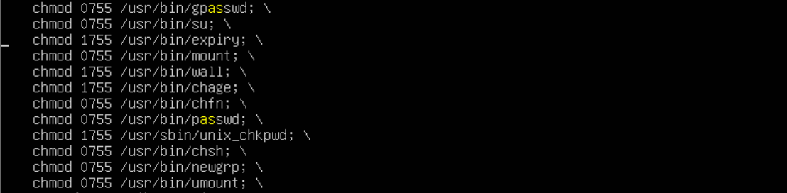
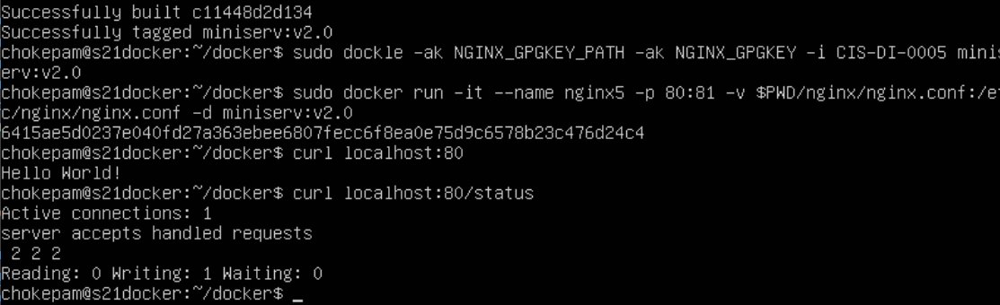
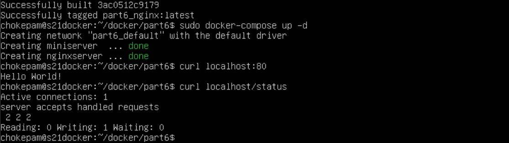

# Simple Docker (chokepam).

Введение в докер. Разработка простого докер-образа для собственного сервера.

## Part 1. Готовый докер

**== Задание 1 ==**

##### Возьми официальный докер-образ с **nginx** и выкачай его при помощи `docker pull`.
##### Проверь наличие докер-образа через `docker images`.
##### Запусти докер-образ через `docker run -d [image_id|repository]`.
##### Проверь, что образ запустился через `docker ps`.
##### Посмотри информацию о контейнере через `docker inspect [container_id|container_name]`.
##### По выводу команды определи и помести в отчёт размер контейнера, список замапленных портов и ip контейнера.
##### Останови докер образ через `docker stop [container_id|container_name]`.
##### Проверь, что образ остановился через `docker ps`.
##### Запусти докер с портами 80 и 443 в контейнере, замапленными на такие же порты на локальной машине, через команду *run*.
##### Проверь, что в браузере по адресу *localhost:80* доступна стартовая страница **nginx**.
##### Перезапусти докер контейнер через `docker restart [container_id|container_name]`.
##### Проверь любым способом, что контейнер запустился.

- В отчёт помести скрины:
  - вызова и вывода всех использованных в этой части задания команд;
  - стартовой страницы **nginx** по адресу *localhost:80* (адрес должен быть виден).
  
**== Выполнение 1 ==**

 * Предварительно установив Docker: `sudo apt install docker.io -y` и `sudo apt install docker-compose` (для *Part 6.*), при помощи команды:`docker pull nginx` скачиваем официальный докер-образ с DockerHub:
 
 *Cкачиваем докер-образ nginx* 

 * Проверяем наличие докер-образа командой: `sudo docker images`
   
 *Докер-образы* 

 * Запускаем докер-образ: `sudo docker run -d nginx`, используем флаг -d для запуска в фоновом режиме:
 
 *Запуск докер-образа* 

 * Смотрим информацию о контейнере: 
   -  размер контейнера SizeRootFs в байтах можно посмотреть в выводе: `sudo docker inspect serene_driscoll --size | grep Size`, где: 
      - ShmSize - размер разделяемой памяти, который был указан при создании или запуске контейнера в Docker. В нем содержится информация о количестве памяти, выделенной для обмена данными между процессами в контейнере. "ShmSize": 67108864, означает, что для контейнера установлен размер разделяемой памяти 64 МБ (67108864 байт).
      - SizeRw - размер созданных или измененных файлов (показывает размер данных, которые были записаны в слой (read-write layer) в процессе работы контейнера). Сразу после создания контейнера это значение должно быть равно нулю.
      - SizeRootFs - размер базового контейнера (размер всех файлов в контейнере).

       
       *Размер контейнера* 

   - Список замапленных портов удобно посмотреть в файле, в который сохраняем вывод команды: `sudo docker inspect serene_driscoll > ng1.txt` и открыв его например в mc
   
   *Список замапленных портов не настроен поле ключа PortBindings контейнера будет пустым* 
     
    *Пустое поле в PortBindings* 
   - ip контейнера можно посмотреть аналогично:
     
    *ip контейнера- IPAddress: "172.17.0.2"* 

 * Остановим докер образ: `sudo docker stop serene_driscoll` и через `docker ps`проверим, что образ остановился:
      
    *Докер образ остановлен* 

 *  Запустим докер с портами 80 и 443 в контейнере, замапленными на такие же порты на локальной машине командой: `sudo docker run -d -p 80:80 -p 443:443 nginx` и проверим, что по адресу *localhost:80* доступна стартовая страница **nginx**: `curl localhost` (по  умолчанию 80 port):
      
    *Докер образ запущен с замапленными портами и nginx доступен по localhost:80* 

     То же, только в браузере Firefox:
       
    *nginx доступен по localhost:80* 

 * Перезапускаем докер контейнер через `docker restart [container_id|container_name]` и проверяем что он запущен: `sudo docker ps` и  `curl localhost:80`:
      
    *nginx доступен по localhost:80* 

## Part 2. Операции с контейнером

**== Задание 2 ==**
##### Прочитай конфигурационный файл *nginx.conf* внутри докер контейнера через команду *exec*.
##### Создай на локальной машине файл *nginx.conf*.
##### Настрой в нем по пути */status* отдачу страницы статуса сервера **nginx**.
##### Скопируй созданный файл *nginx.conf* внутрь докер-образа через команду `docker cp`.
##### Перезапусти **nginx** внутри докер-образа через команду *exec*.
##### Проверь, что по адресу *localhost:80/status* отдается страничка со статусом сервера **nginx**.
##### Экспортируй контейнер в файл *container.tar* через команду *export*.
##### Останови контейнер.
##### Удали образ через `docker rmi [image_id|repository]`, не удаляя перед этим контейнеры.
##### Удали остановленный контейнер.
##### Импортируй контейнер обратно через команду *import*.
##### Запусти импортированный контейнер.
##### Проверь, что по адресу *localhost:80/status* отдается страничка со статусом сервера **nginx**.

- В отчёт помести скрины:
  - вызова и вывода всех использованных в этой части задания команд;
  - содержимое созданного файла *nginx.conf*;
  - страницы со статусом сервера **nginx** по адресу *localhost:80/status*.

**== Выполнение 2 ==**

* Читаем конфигурационный файл *nginx.conf* внутри докер контейнера и копируем на локальную машину командой: `sudo docker exec sleepy_cori cat etc/nginx/nginx.conf > nginx.conf`
 
 *Содержимое файла *nginx.conf* 

* Настраимием в файле *nginx.conf* по пути */status* отдачу страницы статуса сервера **nginx** для этого добавляем следующие строки: 
 
 *Добавляемые строки в *nginx.conf** 

   
   *Содержимое файла nginx.conf* 

  Также в *nginx.conf* закомменчиваем строку:
   

* Копируем созданный файл *nginx.conf* внутрь докер-образа. В данном случае используем команду: `sudo docker cp ./nginx.conf sleepy_cori:etc/nginx/nginx.conf`. Перезапускаем **nginx** внутри докер-образа: `sudo docker exec sleepu_cori nginx -s reload`
  
   *Копирование файла *nginx.conf* и перезапуск **nginx*** 

* Проверяем что по адресу *localhost:80/status* отдается страничка со статусом сервера **nginx**
 
   *Страничка со статусом сервера* 

* Экспортируем контейнер в файл *container.tar*: `sudo docker export -o ./docker/container.tar [container_id|container_name]`
 
   *Файл *container.tar** 

* Останавливаем контейнер через: `sudo docker stop epic_pike`
 
   *Контейнер остановлен* 

* Удаляем образ через: `sudo docker rmi -f nginx`
 
   *Удаляем образ* 

* Удаляем остановленный контейнер: `sudo docker rm [container_id|container_name]`
 
   *Удаляем контейнер* 

* Импортируем контейнер обратно через: `sudo docker import container.tar part2` 
 
   *Импортируем контейнер* 

* Запускаем импортированный контейнер с учетом проброса портов между хостом и контейнером: `sudo docker run -p 80:80 -p 443:443 -d part2 nginx -g 'daemon off;'`и проверяем, что по адресу *localhost:80/status* отдается страничка со статусом сервера **nginx**:
   - -d - запускает контейнер в фоновом режиме (daemon mode)
   - part2 - импортированный образ контейнера, который должен быть использован
   - nginx - команда, выполненяемая внутри контейнера, в нашем случае, запускается веб-сервер Nginx
   - -g 'daemon off;' - дополнительные аргументы для команды запуска Nginx. В данном случае, daemon off гарантирует, что Nginx будет запущен в "неблокирующем" режиме, то есть будет оставаться активным в фоновом режиме и не завершится сразу после запуска контейнера.

   
   *Запускаем контейнер* 

## Part 3. Мини веб-сервер

Теперь стоит немного оторваться от докера, чтобы подготовиться к последнему этапу. Время написать свой сервер.

**== Задание 3 ==**

##### Напиши мини-сервер на **C** и **FastCgi**, который будет возвращать простейшую страничку с надписью `Hello World!`.
##### Запусти написанный мини-сервер через *spawn-fcgi* на порту 8080.
##### Напиши свой *nginx.conf*, который будет проксировать все запросы с 81 порта на *127.0.0.1:8080*.
##### Проверь, что в браузере по *localhost:81* отдается написанная тобой страничка.
##### Положи файл *nginx.conf* по пути *./nginx/nginx.conf* (это понадобится позже).

**== Выполнение 3 ==**

* Напишем мини-сервер на  **C** и **FastCgi**, который будет возвращать страничку с надписью `Hello World!`

   
   *Возвращает страничку с надписью `Hello World!`* 

* Пишем свой nginx.conf, который будет проксировать все запросы с 81 порта на 127.0.0.1:8080
   
   * nginx.conf* 

* Для запуска мини-сервера:
  - Сначала запускаем контейнер с замапленным портом 81: `sudo docker run -d -p 81:81 nginx`
     
     *Запуск контейнера* 

  - Затем копируем в него файл **miniserv.c** мини-сервера: `sudo docker cp miniserv.c focused_wu:/home/` и nginx.conf
      
  *Копируем в контейнер miniserv.с* 
      
  *Копируем в контейнер nginx.conf* 

  - Заходим в контейнер: `sudo docker exec -it focused_wu bash`, обновляем
      
  *Заходим в контейнер с miniserv.с* 

  - устанавливаем библиотеки для запуска мини-сервера: `apt install gcc libfcgi-dev spawn-fcgi`, где gcc - для компиляции, libfcgi-dev - библиотека **FastCgi** используемая мини-сервером, spawn-fcgi - инструмент для запуска и управления FastCGI-программами.
  

  - Компилируем: `gcc -o web miniserv.c -lfcgi`, запускаем мини-сервер: `spawn-fcgi -p 8080 ./web`, перезагружаем: ` nginx -s reload`
    

* Проверяем что в браузере по  по *localhost:81* отдается страничка с надписью `Hello World!`
  

## Part 4. Свой докер

Теперь всё готово. Можно приступать к написанию докер-образа для созданного сервера.

**== Задание 4 ==**

*При написании докер-образа избегай множественных вызовов команд RUN*

#### Напиши свой докер-образ, который:
##### 1) собирает исходники мини сервера на FastCgi из [Части 3](#part-3-мини-веб-сервер);
##### 2) запускает его на 8080 порту;
##### 3) копирует внутрь образа написанный *./nginx/nginx.conf*;
##### 4) запускает **nginx**.
_**nginx** можно установить внутрь докера самостоятельно, а можно воспользоваться готовым образом с **nginx**'ом, как базовым._

##### Собери написанный докер-образ через `docker build` при этом указав имя и тег.
##### Проверь через `docker images`, что все собралось корректно.
##### Запусти собранный докер-образ с маппингом 81 порта на 80 на локальной машине и маппингом папки *./nginx* внутрь контейнера по адресу, где лежат конфигурационные файлы **nginx**'а (см. [Часть 2](#part-2-операции-с-контейнером)).
##### Проверь, что по localhost:80 доступна страничка написанного мини сервера.
##### Допиши в *./nginx/nginx.conf* проксирование странички */status*, по которой надо отдавать статус сервера **nginx**.
##### Перезапусти докер-образ.
*Если всё сделано верно, то, после сохранения файла и перезапуска контейнера, конфигурационный файл внутри докер-образа должен обновиться самостоятельно без лишних действий*
##### Проверь, что теперь по *localhost:80/status* отдается страничка со статусом **nginx**

**== Выполнение 4 ==**

* Создаем докер-образ, для этого:
  - Создаем start.sh, в которм определяем команды в порядке выполнения для ENTRYPOINT - при запуске контейнера они будут выполнены
   
     *Команды в start.sh* 

  - Создаем Dockerfile, в котором копируем исходники, устанавливаем необходимые инструменты и запускаем start.sh, который собирает исходники мини-сервера, запускает его на 8080 порту и запускает **nginx**
   
     *Dockerfile* 

* Собираем написанный докер-образ: `sudo docker build . -t miniserv:v1.0` и проверяем что образ собран: `sudo docker images`
   
    
     *Собранный докер-образ miniserv* 

* Запускаем собранный докер-образ с маппингом 81 порта на 80 на локальной машине и маппингом папки *./nginx* внутрь контейнера по адресу, где лежат конфигурационные файлы **nginx**'а командой: `sudo docker run -it --name nginx4 -p 80:81 -v $PWD/nginx/nginx.conf:/etc/nginx/nginx.conf -d miniserv:v1.0` 
    
     *Запуск докер-образа miniserv* 

* Проверяем что по localhost:80 доступна страничка мини сервера
  
     *страничка мини сервера* 

* В *./nginx/nginx.conf*  добавляем проксирование странички */status*, по которой будет отдаваться статус сервера **nginx**
  
     *nginx.conf* 

* Презапускаем докер-образ: `sudo restart nginx4` и проверяем что теперь по *localhost:80/status* отдается страничка со статусом **nginx**: `curl localhost/status`
  
     *Перезапуск докер-образа* 

* Также проверяем, в браузере, что теперь по *localhost:80/status* отдается страничка со статусом **nginx**
  
     *страничка со статусом **nginx*** 

## Part 5. **Dockle**

После написания образа никогда не будет лишним проверить его на безопасность.

**== Задание 5 ==**

##### Просканируй образ из предыдущего задания через `dockle [image_id|repository]`.
##### Исправь образ так, чтобы при проверке через **dockle** не было ошибок и предупреждений.

**== Выполнение 5 ==**

* Скачиваем и устанавливаем Dockle: `
   
  
     *Установка **Dockle*** 

* Просканируем образ из предыдущего задания через: `sudo dockle miniserv:v1.0`
  
     *Результат сканирования докер-образа* 

* Для исправления ошибок и предупреждений внесем следующие изменения в Dockerfile:
  - DKL-DI-0005 - добавляем команду: `rm-rf /var/lib/apt/lists`
  - CIS-DI-0001 - изменяем USER c root на nginx: `USER nginx` и применяем `chown -R` к необходимым подкаталогам  
  - CIS-DI-0006 - добавляем проверку: `HEALTHCHECK --interval=20s --start-periiod=5s --timeout=3s CMD curl localhost:80 || exit 1`
  - CIS-DI-0008 - добавляем необходимые разрешения:
  
  - CIS-DI-0005 - в данном проекте не используется.(игнорируем) (Применяется для дополнительной безопасности при работе с контейнерами - проверке их подлинности и подписи перед загрузкой и запуском. Для этого необходимо включить DCT: `export DOCKER_CONTENT_TRUST=1` сгенерировать ключ: `docker trust key generate <user>`, где `<user>` - логин на Docker Hub, создать зону доверия (trust zone) с помощью команды:`docker trust signer add --key <ключ> <репозиторий>` и затем подписать образ с помощью команды: `docker trust sign <репозиторий:тег>`) 
  - DKL-DI-0010 - делаем исключение для ключей NGINX: `-ak NGINX_GPGKEY -ak NGINX_GPGKEY_PATH`  (для исправления можно использовать другой образ вместо nginx - (Alpine, debian)).

* Измененный Dockerfile
     
     *Dockerfile* 

* Пересобираем докер-образ: 
  

   Проверяем исправленный образ с учетом исключений: `sudo dockle -ak NGINX_GPGKEY_PATH -ak NGINX_GPGKEY -i CIS-DI-0005 miniserv:v2.0` - все ошибки исправлены.
     Также проверяем что сервер работает: `curl localhost:80` и `curl localhost:80.status` - получен ответ в обоих случаях.
   
     *Ошибки, выявленные с помощью Dockle - устранены, сервер работает* 

## Part 6. Базовый **Docker Compose**

**== Задание 6 ==**

##### Напиши файл *docker-compose.yml*, с помощью которого:
##### 1) Подними докер-контейнер из [Части 5] _(он должен работать в локальной сети, т.е. не нужно использовать инструкцию **EXPOSE** и мапить порты на локальную машину)_.
##### 2) Подними докер-контейнер с **nginx**, который будет проксировать все запросы с 8080 порта на 81 порт первого контейнера.
##### Замапь 8080 порт второго контейнера на 80 порт локальной машины.

##### Останови все запущенные контейнеры.
##### Собери и запусти проект с помощью команд `docker-compose build` и `docker-compose up`.
##### Проверь, что в браузере по *localhost:80* отдается написанная тобой страничка, как и ранее.

**== Выполнение 6 ==**

* Поднимаем докер-контейнер из [Части 5]: `sudo docker run -it --name nginx5 -v $PWD/nginx/nginx.conf:/etc/nginx/nginx.conf -it miniserv:v2.0`
   ![Докер-контейнер из [Части 5]](pictures/49.png)

* Собираем:  `sudo docker build . -t nginxserv:1.0` и поднимаем чистый nginx сервер с маппингои 80 на 8080: `sudo docker run -p 80:8080 -it --name nginx6 -v $PWD/nginx/nginx.conf:/etc/nginx/nginx.conf -d nginxserv:1.0`, а внутри проксируем все на 81 первого:
  

  Смотрим IP-адрес запущенного первого контейнера: `sudo docker inspect -s nginx5 | grep IP` (172.17.0.2), 
 

  затем указываем его в *nginx.conf* второго запущенного чистого nginx сервера для перенаправления на наш минисервер 
  
   *nginx.conf второго запущенного чистого nginx сервера* 

  Перезапускаем второй контейнер: `sudo docker restart nginx6`, чтобы применился nginx.conf.   Проверяем что все работает:
    
   *Рестарт nginx сервера и проверка работы сервера* 

* Останавливаем все запущенные контейнеры.

* Для сбора и запуска проекта с помощью команд `docker-compose build` и `docker-compose up`:
  - Создаем файл *docker-compose.yml*: `touch docker-compose.yml`, который начинаем с указания версии, прописываем в разделе *services:* два наших контейнера (miniserver, nginx), и для каждого контейнера прописываем название - container_name, в build - пути к соответствующим Dockerfile, а для контейнера nging в ports - маппинг портов [порт компьютера]:[порт контейнера] в соответсвии с заданием это 8080 порт второго контейнера на 80 порт локальной машины.
    
   *Содержимое файла *docker-compose.yml** 

  - В *nginx.conf* второго контейнера (чистого nginx сервера) прописываем в *proxy_pass* адрес мини-сервера.
    
   *nginx.conf второго запущенного чистого nginx сервера* 

  - Собираем проект: `docker-compose build`
    
  - Запускаем проект: `docker-compose up -d`, проверяем что по *localhost:80* отдается **Hello World**, 
      
   *Запуск и проверка проекта.* 

  * Проверяем, что в браузере по *localhost:80* отдается страничка  **Hello World**, как и ранее.
     

     Останавливаем: `sudo docker-compose down`
     

* Результат работы - в соответствии с заданием загружаем в репозиторий:
    - Part 1 - REPORT.md
    - Part 2 - REPORT.md
    - Part 3 - REPORT.md и в `src/server` исходные файлы для запуска веб-сервера
    - Part 4 - REPORT.md, в `src/` файл `Dockerfile.part4` и `start.sh` (`sudo docker build . -f Dockerfile.part4 -t miniserv:v1.0` - билд и `sudo docker run -it --name nginx4 -p 80:81 -v $PWD/server/nginx/nginx.conf:/etc/nginx/nginx.conf -d miniserv:v1.0` - запуск)
    - Part 5 - REPORT.md и в `src/` файл `Dockerfile` (`sudo docker build . -f Dockerfile -t miniserv:v2.0` - билд и `sudo docker run -it --name nginx5 -p 80:81 -v $PWD/server/nginx/nginx.conf:/etc/nginx/nginx.conf -d miniserv:v2.0` - запуск)
    - Part 6 - REPORT.md, в `src/` файл `docker-compose.yml` и в `src/nginxserv` - Dockerfile и конфиг для чистого сервера **nginx** (`docker-compose build`- билд, `docker-compose up -d` - запуск)